# Database Design

PostgreSQL 16 · Prisma ORM · fully normalized (3NF) · UUID primary keys ·
`Decimal` money columns · indexed foreign keys and hot filters · enum-typed workflow states.

Migrations live in `backend/prisma/migrations/`; the seed
(`backend/prisma/seed.ts`) loads the complete DAR workbook dataset.

## Entity-relationship overview (core domains)

```mermaid
erDiagram
    COMPANY ||--o{ USER : employs
    COMPANY ||--o{ PROJECT : owns
    COMPANY ||--o{ PARTY : maintains
    COMPANY ||--o{ EMPLOYEE : employs
    ROLE ||--o{ USER : grants
    ROLE ||--o{ ROLE_PERMISSION : has
    PERMISSION ||--o{ ROLE_PERMISSION : in

    PARTY ||--o{ PROJECT : "client / consultant"
    PROJECT ||--o{ WBS_NODE : decomposes
    PROJECT ||--o{ TASK : schedules
    WBS_NODE ||--o{ TASK : groups
    TASK ||--o{ TASK_DEPENDENCY : "predecessor / successor"
    TASK ||--o{ TASK_ASSIGNMENT : staffs
    EMPLOYEE ||--o{ TASK_ASSIGNMENT : assigned
    PROJECT ||--o{ BASELINE : snapshots
    BASELINE ||--o{ BASELINE_TASK : freezes
    PROJECT ||--o{ MILESTONE : tracks

    PROJECT ||--o{ COST_CODE : structures
    COST_CODE ||--o{ BUDGET_LINE : budgets
    COST_CODE ||--o{ COST_ENTRY : "actuals ledger"
    PROJECT ||--o{ CASHFLOW_LINE : forecasts
    PROJECT ||--o{ INVOICE : bills
    INVOICE ||--o{ PAYMENT_RECEIPT : receives
    PROJECT ||--o{ BOQ_ITEM : quantifies
    PROJECT ||--o{ ESTIMATE : prices
    ESTIMATE ||--o{ ESTIMATE_LINE : contains

    PROJECT ||--o{ PURCHASE_REQUEST : raises
    PURCHASE_REQUEST ||--o{ RFQ : sources
    RFQ ||--o{ QUOTATION : receives
    PARTY ||--o{ QUOTATION : submits
    PROJECT ||--o{ PURCHASE_ORDER : commits
    PARTY ||--o{ PURCHASE_ORDER : supplies
    PURCHASE_ORDER ||--o{ PURCHASE_ORDER_LINE : contains
    PURCHASE_ORDER ||--o{ GOODS_RECEIPT : delivers
    PURCHASE_ORDER ||--o{ SUPPLIER_PAYMENT : pays

    MATERIAL ||--o{ STOCK_LEVEL : stocked
    WAREHOUSE ||--o{ STOCK_LEVEL : holds
    WAREHOUSE ||--o{ STOCK_MOVEMENT : ledgers
    MATERIAL ||--o{ STOCK_MOVEMENT : moves
    PROJECT ||--o{ MATERIAL_REQUEST : requests
    MATERIAL_REQUEST ||--o{ MATERIAL_REQUEST_LINE : contains

    EQUIPMENT ||--o{ EQUIPMENT_ASSIGNMENT : deployed
    PROJECT ||--o{ EQUIPMENT_ASSIGNMENT : uses
    EQUIPMENT ||--o{ MAINTENANCE : maintained
    EQUIPMENT ||--o{ FUEL_LOG : fuels

    EMPLOYEE ||--o{ ATTENDANCE : records
    PAYROLL_RUN ||--o{ PAYROLL_ITEM : contains
    EMPLOYEE ||--o{ PAYROLL_ITEM : paid
    EMPLOYEE ||--o{ SAFETY_TRAINING_RECORD : certified

    PROJECT ||--o{ RISK : registers
    PROJECT ||--o{ ISSUE : logs
    PROJECT ||--o{ VARIATION_ORDER : varies
    PROJECT ||--o{ DAILY_REPORT : reports
    DAILY_REPORT ||--o{ DAILY_MANPOWER_LINE : manpower
    DAILY_REPORT ||--o{ DAILY_EQUIPMENT_LINE : equipment
    PROJECT ||--o{ PROGRESS_REPORT : summarizes
    PROJECT ||--o{ DOCUMENT : files
    PROJECT ||--o{ DRAWING : registers
    PROJECT ||--o{ RFI : queries
    PROJECT ||--o{ SUBMITTAL : submits
    PROJECT ||--o{ NCR : "non-conformance"
    PROJECT ||--o{ SAFETY_INCIDENT : records

    USER ||--o{ AUDIT_LOG : acts
    USER ||--o{ NOTIFICATION : notified
    USER ||--o{ AI_CONVERSATION : chats
    AI_CONVERSATION ||--o{ AI_MESSAGE : contains
```

## Conventions & integrity

- **Constraints**: composite uniques on natural keys (`(projectId, code)`,
  `(companyId, code)`, `(warehouseId, materialId)`, `(employeeId, date)` …);
  FK cascades scoped so deleting a project removes only its children.
- **Money**: `Decimal(18,2)`; rates/percentages `Decimal(5,4)`.
- **Workflow states**: PostgreSQL enums (28 enums) — invalid states are unrepresentable.
- **Derived data**: CPM results (`earlyStart…totalFloat,isCritical`) persisted on `tasks`
  for fast reads and recomputed by the engine on demand; stock levels maintained
  transactionally beside an immutable `stock_movements` ledger (auditable and rebuildable).
- **i18n**: translatable columns (`nameAr`, `nameFr`) on key entities plus a generic
  `translations` table for arbitrary entity/field/locale values.
- **Aggregate views**: cost-control, EVM, cash-flow and dashboard aggregates are exposed as
  service-layer queries (Prisma `groupBy`/transactions) rather than DB views so they stay
  migration-safe; heavy reporting can be promoted to materialized views without API changes.

## Seeded dataset (from the workbook)

Company + 6 users (one per role) · 16 employees with rates · 24 parties ·
project **DAR-CTR-2025-001** with 71 tasks / 15 WBS phases / 70 date-derived dependencies /
active baseline · 4 milestones · 14 cost codes with budgets and 6 months of actuals ·
12 purchase orders + supplier payments · 15 materials with stock ledger · 10 equipment
with assignments & preventive maintenance · 10 risks · 8 issues · 6 variation orders ·
cash-flow forecast (12×8) · resource allocation matrix · June attendance (drives payroll) ·
daily site report · drawings, RFIs, submittals, NCR, method statements, inspections,
safety trainings.
